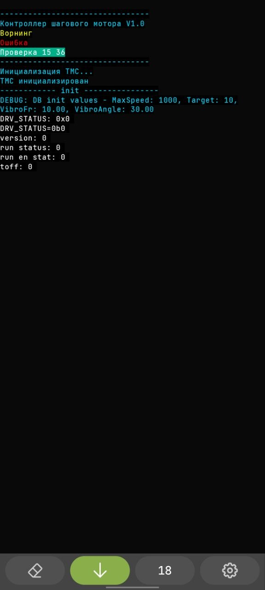
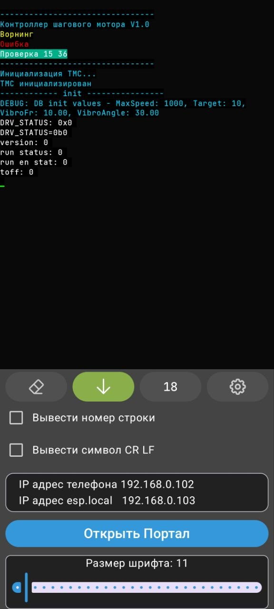
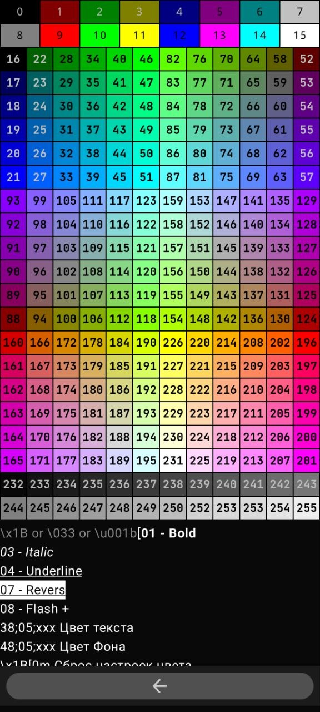
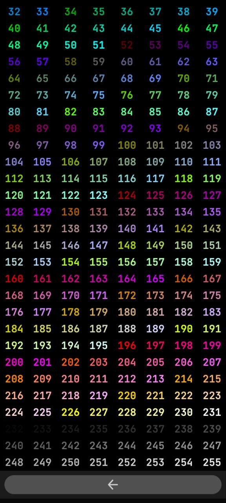
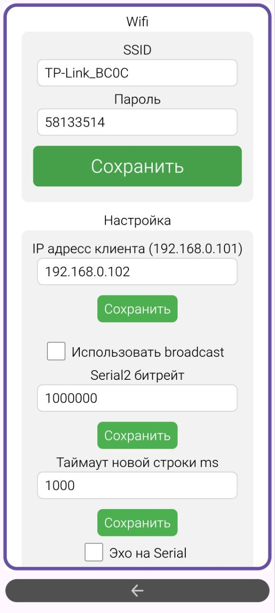

# TerminalM3

`TerminalM3` - Android-приложение для приема и отображения текстовых логов, ANSI-последовательностей и UI-виджетов, которые приходят от микроконтроллеров и других сетевых устройств.

Сейчас проект уже не ограничивается простым UDP-терминалом. Репозиторий включает несколько связанных частей:

- Android-приложение `TerminalM3`
- систему консольных Compose-виджетов
- C++ библиотеку `TimberWidget` для Arduino / PlatformIO
- прошивку `ESP32 UART to TCP Bridge`, которая передает поток из UART в Android по TCP и принимает обратные сообщения из Android

## Что умеет Android-приложение

- Показывать живой поток текстовых сообщений в консоли.
- Разбирать ANSI / ESC-последовательности: цвет текста, фон, стили и другие атрибуты.
- Отображать не только текст, но и Compose-виджеты, пришедшие по строковому протоколу.
- Работать с несколькими каналами консоли, включая общий канал `ALL`.
- Подключаться к ESP32 как `TCP client`.
- Следить за состоянием соединения через отдельный `UDP heartbeat`.
- Открывать web-портал устройства прямо из приложения.

## Актуальная схема связи с ESP32

Текущий основной сценарий работы такой:

```text
ESP32 UART -> TCP server:8888 -> Android TerminalM3
Android TerminalM3 -> TCP server:8900 -> ESP32 SimpleCLI
                     \-> UDP 8888 heartbeat ping/pong
```

Важно:

- передача UART-данных теперь идет через `TCP`
- Android может отправлять команды `SimpleCLI` в ESP32 по `TCP 8900`
- `UDP broadcast` для основного потока больше не используется
- `UDP` остался для heartbeat и некоторых служебных сценариев, например внешнего OLED-экрана

Подробное описание прошивки ESP32 лежит отдельно:

- [ESP32 UART to TCP Bridge README](ESP32_C3_Uart_to_Udp/README.md)

## Скриншоты

<p align="center">
  
  
  
</p>

<p align="center">
  
  
</p>

## Документация

- [README консольных виджетов Android](app/src/main/java/com/example/terminalm3/console/README.md)
- [README библиотеки TimberWidget](TimberWidget/README.md)
- [README прошивки ESP32 UART to TCP Bridge](ESP32_C3_Uart_to_Udp/README.md)

## Стек

- Kotlin
- Jetpack Compose
- Material 3
- Timber
- C++ для микроконтроллерной библиотеки и прошивки ESP32

## Сборка Android

Требования:

- Android Studio
- JDK 17
- Android 6.0+ (`minSdk 23`)

Как запустить:

1. Открыть проект в Android Studio.
2. Дождаться синхронизации Gradle.
3. Запустить конфигурацию `app` на устройстве или эмуляторе.

## Что еще посмотреть

Если нужен именно протокол виджетов и сырые строки команд:

- [полный гайд по console widgets](app/src/main/java/com/example/terminalm3/console/README.md)

Если нужен C++ API для Arduino / PlatformIO:

- [документация TimberWidget](TimberWidget/README.md)

Если нужен сетевой мост ESP32 с UART:

- [документация прошивки ESP32](ESP32_C3_Uart_to_Udp/README.md)
