# Команды консольных виджетов

Гайд по командам, которые понимает консольный декодер и через которые можно создавать Compose-виджеты прямо из сообщений микроконтроллера.

Файлы, на которые опирается этот гайд:

- `ConsoleWidgetProtocol.kt`
- `ConsoleWidgetProtocolExtras.kt`
- `ConsoleWidgetProtocolTelemetry.kt`
- `ConsoleWidgetProtocolDashboard.kt`
- `widgets/*.kt`
- `img/*.png`

Картинки виджетов лежат рядом с этим файлом в папке `./img`, поэтому ссылки в этом README будут корректно работать и локально, и на GitHub.

## Зарегистрированные команды

### `beep`

Служебная команда. Проигрывает звуковой сигнал на телефоне и вставляет локальный элемент в консоль.

Пример:

```text
beep
```

### `ui`

Основная команда для создания виджетов в консоли.

### `widget`

Полный алиас команды `ui`. Работает точно так же.

Пример:

```text
ui type=badge text="READY"
widget type=badge text="READY"
```

## Общий формат

```text
ui type=<widgetType> key=value key=value ...
```

Примеры:

```text
ui type=badge text="READY" bg=#1F7A1F fg=#FFFFFF size=14
ui type=panel title="Motor 1" value=READY subtitle="24.3V" accent=#36C36B icon=info
ui type=table headers="Name|State|Temp" rows="M1|READY|24.3;M2|WAIT|22.9"
ui type=sparkline label="Temp" values="21,22,22,23,24,23,25" color=#36C36B
ui type=led-row title="Links" items="NET:#00E676|MQTT:#00E676|ERR:#FF5252|GPS:off"
```

## Правила синтаксиса

1. Команда должна приходить завершенной строкой.
2. Завершение по `\n`, формат `\r\n` тоже подходит.
3. Аргументы передаются как `key=value`.
4. Значения с пробелами нужно брать в кавычки:

```text
ui type=panel title="Motor 1" subtitle="24.3V 1.8A"
```

5. Поддерживаются одинарные и двойные кавычки.
6. Булевы значения можно передавать как:
   `on/off`, `true/false`, `1/0`, `yes/no`.
7. Цвета можно передавать как:
   `#RRGGBB`, `#AARRGGBB`, либо именами `black`, `white`, `red`, `green`, `blue`, `yellow`, `cyan`, `magenta`, `gray`, `orange`.
8. Для списков значений используются разделители `|`, `,` или `;` в зависимости от типа виджета.

## Быстрые примеры

```text
ui type=badge text="READY" bg=#1F7A1F fg=#FFFFFF size=14
ui type=dot color=#00E676 size=16 label="Link active"
ui type=image name=info size=40 desc="Info icon"
ui type=panel title="Motor 1" value=READY subtitle="24.3V 1.8A" accent=#36C36B icon=info
ui type=progress label="Battery" value=72 max=100 fill=#36C36B display="72%"
ui type=2col left="Voltage" right="24.3V"
ui type=table headers="Name|State|Temp" rows="M1|READY|24.3;M2|WAIT|22.9;M3|ALARM|91.8"
ui type=switch label="Pump enable" state=on subtitle="Remote mode"
ui type=alarm-card title="Overheat" message="Motor 1 temperature reached 92C" severity=critical time="12:41:03" icon=warn2
ui type=sparkline label="Temp" values="21,22,22,23,24,23,25" min=18 max=28 color=#36C36B display="25C" points=on
ui type=bar-group title="Motors" labels="M1|M2|M3" values="20|45|80" max=100 colors="#36C36B|#4FC3F7|#FFB300"
ui type=gauge label="CPU" value=72 max=100 unit="%" color=#36C36B
ui type=battery label="Battery A" value=78 max=100 charging=true voltage=4.08
ui type=led-row title="Links" items="NET:#00E676|MQTT:#00E676|ERR:#FF5252|GPS:off"
ui type=stats-card title="RPM" value=1450 unit="rpm" delta="+12" subtitle="Motor 1" accent=#36C36B
ui type=kv-grid title="Motor 1" items="Voltage:24.3V|Current:1.8A|Temp:62C|State:READY" columns=2
ui type=pin-bank title="GPIO" items="D1:on|D2:off|D3:warn|A0:adc|PWM1:pwm"
ui type=timeline title="Boot" items="12:01 Boot|12:03 WiFi connected|12:05 MQTT online"
ui type=line-chart title="Voltage" values="24.1,24.2,24.0,24.3,24.4" labels="T1|T2|T3|T4|T5" min=23 max=25 color=#4FC3F7
```

## Виджеты

### `type=badge`

Короткая округлая плашка для статуса.

Пример:

```text
ui type=badge text="READY" bg=#1F7A1F fg=#FFFFFF size=14
```

<p align="center">
  
  <br />
  <sub>Compose: <code>BadgeConsoleWidget(spec: ConsoleWidgetSpec.Badge)</code></sub>
  <br />
  <sub>Команда: <code>ui type=badge text="READY" bg=#1F7A1F fg=#FFFFFF size=14</code></sub>
</p>

Параметры:

- `text` - текст на плашке
- `bg` - фон
- `fg` - цвет текста
- `size` - размер текста

---

### `type=dot`

Круглый индикатор, можно с подписью справа.

Пример:

```text
ui type=dot color=#00E676 size=16 label="Link active"
```

<p align="center">
  
  <br />
  <sub>Compose: <code>DotConsoleWidget(spec: ConsoleWidgetSpec.Dot)</code></sub>
  <br />
  <sub>Команда: <code>ui type=dot color=#00E676 size=16 label="Link active"</code></sub>
</p>

Параметры:

- `color` - цвет круга
- `size` - размер круга в `dp`
- `label` - подпись справа
- `labelColor` - цвет подписи

---

### `type=image`

Картинка из `res/drawable`.

Пример:

```text
ui type=image name=info size=40 desc="Info icon"
```

<p align="center">
  
  <br />
  <sub>Compose: <code>ImageConsoleWidget(spec: ConsoleWidgetSpec.Image)</code></sub>
  <br />
  <sub>Команда: <code>ui type=image name=info size=40 desc="Info icon"</code></sub>
</p>

Параметры:

- `name` - имя drawable без расширения
- `size` - размер в `dp`
- `desc` - `contentDescription`

---

### `type=panel`

Карточка состояния с акцентной полосой, заголовком, значением и подписью.

Пример:

```text
ui type=panel title="Motor 1" value=READY subtitle="24.3V 1.8A" accent=#36C36B icon=info
```

<p align="center">
  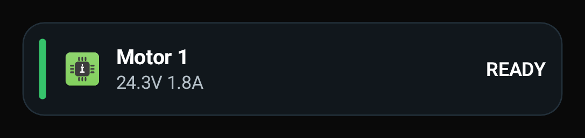
  <br />
  <sub>Compose: <code>PanelConsoleWidget(spec: ConsoleWidgetSpec.Panel)</code></sub>
  <br />
  <sub>Команда: <code>ui type=panel title="Motor 1" value=READY subtitle="24.3V 1.8A" accent=#36C36B icon=info</code></sub>
</p>

Параметры:

- `title` - заголовок карточки
- `value` - значение справа
- `subtitle` - вторая строка
- `accent` - цвет вертикальной полосы слева
- `icon` - drawable слева
- `bg` - фон карточки
- `border` - цвет рамки
- `titleColor` - цвет заголовка
- `valueColor` - цвет значения
- `subtitleColor` - цвет второй строки

---

### `type=progress`

Карточка с полосой прогресса.

Пример:

```text
ui type=progress label="Battery" value=72 max=100 fill=#36C36B display="72%"
```

<p align="center">
  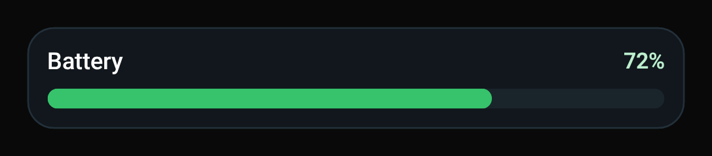
  <br />
  <sub>Compose: <code>ProgressConsoleWidget(spec: ConsoleWidgetSpec.Progress)</code></sub>
  <br />
  <sub>Команда: <code>ui type=progress label="Battery" value=72 max=100 fill=#36C36B display="72%"</code></sub>
</p>

Параметры:

- `label` - подпись слева
- `value` - текущее значение
- `max` - максимальное значение
- `display` - текст справа, например `72%`
- `fill` - цвет заполнения
- `track` - цвет полосы-фона
- `bg` - фон карточки
- `border` - цвет рамки
- `labelColor` - цвет подписи
- `valueColor` - цвет текста справа

---

### `type=2col`

Строка из двух колонок в формате `ключ -> значение`.

Пример:

```text
ui type=2col left="Voltage" right="24.3V"
```

<p align="center">
  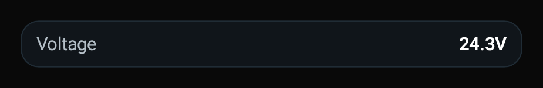
  <br />
  <sub>Compose: <code>TwoColumnConsoleWidget(spec: ConsoleWidgetSpec.TwoColumn)</code></sub>
  <br />
  <sub>Команда: <code>ui type=2col left="Voltage" right="24.3V"</code></sub>
</p>

Параметры:

- `left` - левый текст
- `right` - правый текст
- `leftColor` - цвет левой части
- `rightColor` - цвет правой части
- `bg` - фон
- `border` - цвет рамки

---

### `type=table`

Таблица с заголовками и несколькими строками.

Пример:

```text
ui type=table headers="Name|State|Temp" rows="M1|READY|24.3;M2|WAIT|22.9;M3|ALARM|91.8"
```

<p align="center">
  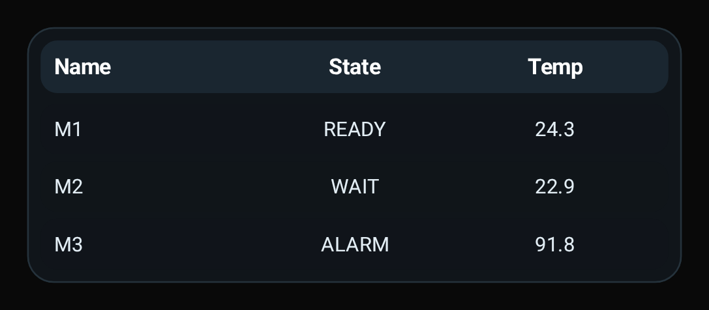
  <br />
  <sub>Compose: <code>TableConsoleWidget(spec: ConsoleWidgetSpec.Table)</code></sub>
  <br />
  <sub>Команда: <code>ui type=table headers="Name|State|Temp" rows="M1|READY|24.3;M2|WAIT|22.9;M3|ALARM|91.8"</code></sub>
</p>

Параметры:

- `headers` - заголовки колонок через `|`
- `rows` - строки через `;`
- ячейки внутри каждой строки разделяются через `|`
- `headerBg` - фон строки заголовков
- `headerColor` - цвет текста заголовков
- `cellColor` - цвет текста ячеек
- `bg` - общий фон таблицы
- `border` - цвет рамки

---

### `type=switch`

Визуальный `ON/OFF`-переключатель без интерактива.

Пример:

```text
ui type=switch label="Pump enable" state=on subtitle="Remote mode"
```

<p align="center">
  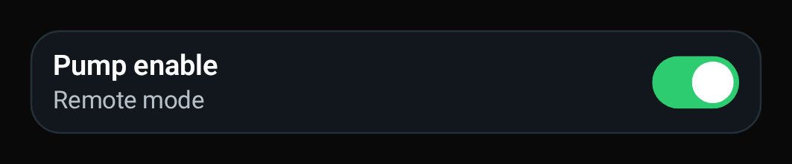
  <br />
  <sub>Compose: <code>SwitchConsoleWidget(spec: ConsoleWidgetSpec.Switch)</code></sub>
  <br />
  <sub>Команда: <code>ui type=switch label="Pump enable" state=on subtitle="Remote mode"</code></sub>
</p>

Параметры:

- `label` - основной текст
- `state` или `checked` - `on/off`, `true/false`, `1/0`
- `subtitle` - вторая строка
- `onColor` - цвет включенного состояния
- `offColor` - цвет выключенного состояния
- `thumb` - цвет бегунка
- `bg` - фон
- `border` - цвет рамки
- `labelColor` - цвет заголовка
- `subtitleColor` - цвет второй строки

---

### `type=alarm-card`

Карточка аварии / предупреждения.

Пример:

```text
ui type=alarm-card title="Overheat" message="Motor 1 temperature reached 92C" severity=critical time="12:41:03" icon=warn2
```

<p align="center">
  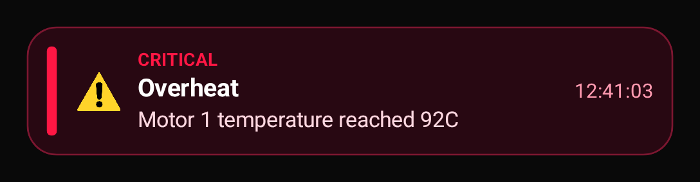
  <br />
  <sub>Compose: <code>AlarmCardConsoleWidget(spec: ConsoleWidgetSpec.AlarmCard)</code></sub>
  <br />
  <sub>Команда: <code>ui type=alarm-card title="Overheat" message="Motor 1 temperature reached 92C" severity=critical time="12:41:03" icon=warn2</code></sub>
</p>

Параметры:

- `title` - заголовок события
- `message` - описание
- `severity` - `info`, `warn`, `error`, `critical`
- `time` - время или служебная meta-строка
- `icon` - drawable слева
- `accent` - цвет акцента
- `bg` - фон
- `border` - цвет рамки
- `titleColor` - цвет заголовка
- `messageColor` - цвет описания
- `metaColor` - цвет времени

---

### `type=sparkline`

Мини-график тренда внутри одной карточки. Подходит для температуры, тока, RSSI, напряжения и других быстро меняющихся значений.

Пример:

```text
ui type=sparkline label="Temp" values="21,22,22,23,24,23,25" min=18 max=28 color=#36C36B display="25C" points=on
```

<p align="center">
  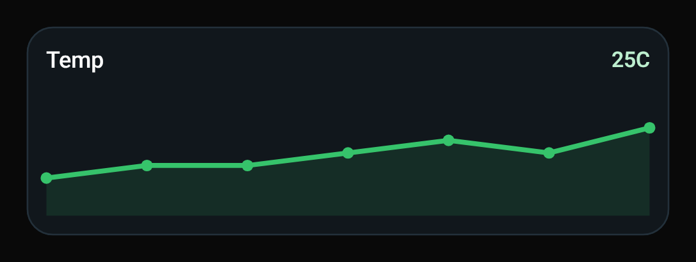
  <br />
  <sub>Compose: <code>SparklineConsoleWidget(spec: ConsoleWidgetSpec.Sparkline)</code></sub>
  <br />
  <sub>Команда: <code>ui type=sparkline label="Temp" values="21,22,22,23,24,23,25" min=18 max=28 color=#36C36B display="25C" points=on</code></sub>
</p>

Параметры:

- `values` - список чисел через `,`, `|` или `;`
- `label` - подпись слева сверху
- `display` - значение справа сверху
- `min` - нижняя граница шкалы
- `max` - верхняя граница шкалы
- `color` - цвет линии
- `fill` - цвет подложки под графиком
- `points` - показывать точки (`on/off`)
- `bg` - фон карточки
- `border` - цвет рамки
- `labelColor` - цвет подписи
- `valueColor` - цвет значения

---

### `type=bar-group`

Группа столбиков для сравнения нескольких каналов или устройств.

Пример:

```text
ui type=bar-group title="Motors" labels="M1|M2|M3" values="20|45|80" max=100 colors="#36C36B|#4FC3F7|#FFB300"
```

<p align="center">
  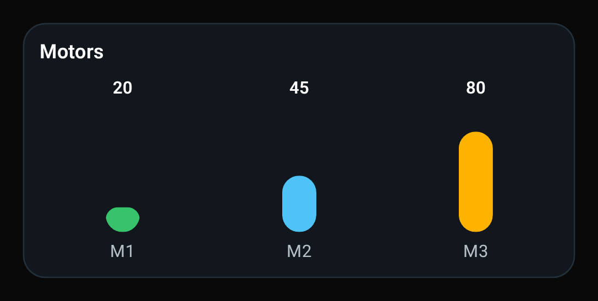
  <br />
  <sub>Compose: <code>BarGroupConsoleWidget(spec: ConsoleWidgetSpec.BarGroup)</code></sub>
  <br />
  <sub>Команда: <code>ui type=bar-group title="Motors" labels="M1|M2|M3" values="20|45|80" max=100 colors="#36C36B|#4FC3F7|#FFB300"</code></sub>
</p>

Параметры:

- `labels` - подписи столбиков через `|`
- `values` - значения столбиков через `|`, `,` или `;`
- `max` - верхняя граница шкалы
- `title` - заголовок карточки
- `color` - общий цвет всех столбиков
- `colors` - список цветов по столбикам через `|`
- `bg` - фон карточки
- `border` - цвет рамки
- `titleColor` - цвет заголовка
- `labelColor` - цвет подписей под столбиками
- `valueColor` - цвет чисел над столбиками

---

### `type=gauge`

Полукруглый индикатор одного значения.

Пример:

```text
ui type=gauge label="CPU" value=72 max=100 unit="%" color=#36C36B
```

<p align="center">
  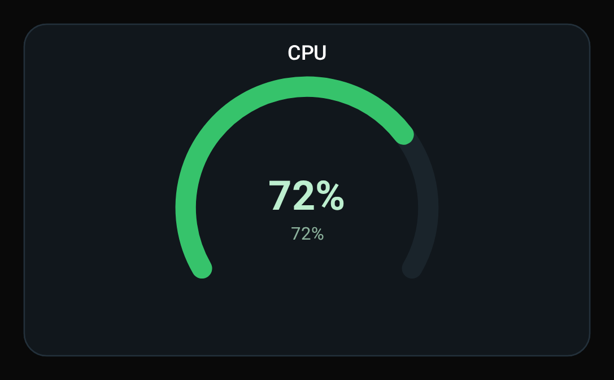
  <br />
  <sub>Compose: <code>GaugeConsoleWidget(spec: ConsoleWidgetSpec.Gauge)</code></sub>
  <br />
  <sub>Команда: <code>ui type=gauge label="CPU" value=72 max=100 unit="%" color=#36C36B</code></sub>
</p>

Параметры:

- `value` - текущее значение
- `max` - максимальное значение
- `label` - подпись сверху
- `unit` - единица измерения, например `%`
- `display` - текст в центре вместо автогенерации
- `color` - цвет дуги
- `track` - цвет фоновой дуги
- `bg` - фон карточки
- `border` - цвет рамки
- `labelColor` - цвет подписи
- `valueColor` - цвет центрального текста

---

### `type=battery`

Виджет состояния батареи с уровнем заряда и дополнительной подписью.

Пример:

```text
ui type=battery label="Battery A" value=78 max=100 charging=true voltage=4.08
```

<p align="center">
  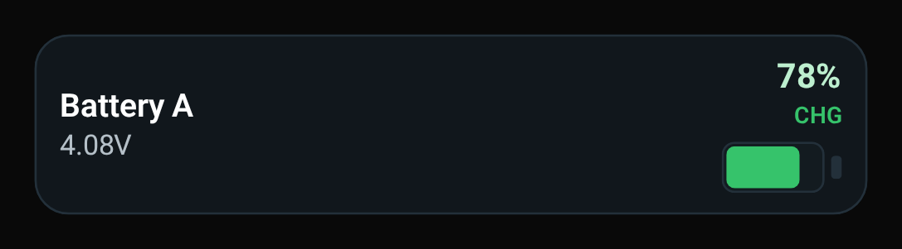
  <br />
  <sub>Compose: <code>BatteryConsoleWidget(spec: ConsoleWidgetSpec.Battery)</code></sub>
  <br />
  <sub>Команда: <code>ui type=battery label="Battery A" value=78 max=100 charging=true voltage=4.08</code></sub>
</p>

Параметры:

- `value` - текущий заряд
- `max` - максимум, обычно `100`
- `label` - подпись слева
- `display` - текст справа, например `78%`
- `subtitle` - дополнительная строка
- `voltage` - альтернативный способ передать подпись напряжения
- `charging` - флаг зарядки (`true/false`, `on/off`)
- `fill` - цвет заполнения батареи
- `track` - цвет внутреннего фона батареи
- `bg` - фон карточки
- `border` - цвет рамки
- `labelColor` - цвет подписи
- `valueColor` - цвет значения
- `subtitleColor` - цвет второй строки

---

### `type=led-row`

Ряд светодиодных индикаторов состояния. Хорошо подходит для каналов связи, датчиков, режимов и флагов.

Пример:

```text
ui type=led-row title="Links" items="NET:#00E676|MQTT:#00E676|ERR:#FF5252|GPS:off"
```

<p align="center">
  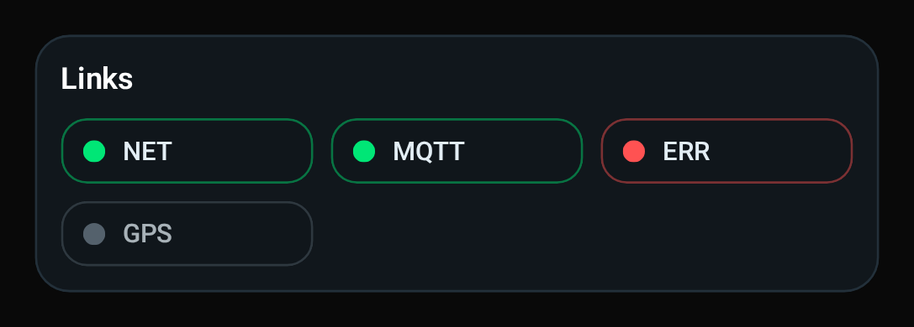
  <br />
  <sub>Compose: <code>LedRowConsoleWidget(spec: ConsoleWidgetSpec.LedRow)</code></sub>
  <br />
  <sub>Команда: <code>ui type=led-row title="Links" items="NET:#00E676|MQTT:#00E676|ERR:#FF5252|GPS:off"</code></sub>
</p>

Параметры:

- `items` - список элементов в формате `NAME:STATE_OR_COLOR` через `|`
- `title` - заголовок карточки
- `bg` - фон карточки
- `border` - цвет рамки
- `titleColor` - цвет заголовка
- `labelColor` - цвет подписи элемента
- `offColor` - цвет выключенного индикатора

Поддерживаемые состояния в `items`:

- `on`, `true`, `1`, `active`, `ok` - активный зеленый индикатор
- `off`, `false`, `0`, `inactive`, `disabled` - выключенный индикатор
- `warn`, `warning` - желтый индикатор
- `error`, `err`, `alarm`, `critical` - красный индикатор
- вместо состояния можно сразу передать цвет: `NET:#00E676`

---

### `type=stats-card`

Компактная карточка одной метрики с большим числом, единицей измерения и дельтой изменения.

Пример:

```text
ui type=stats-card title="RPM" value=1450 unit="rpm" delta="+12" subtitle="Motor 1" accent=#36C36B
```

<p align="center">
  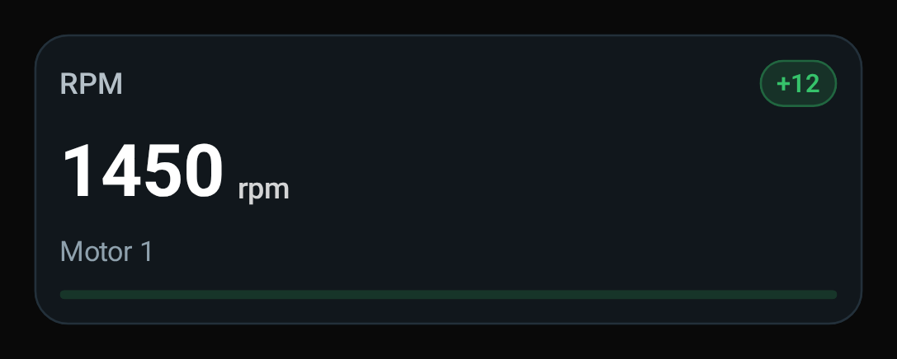
  <br />
  <sub>Compose: <code>StatsCardConsoleWidget(spec: ConsoleWidgetSpec.StatsCard)</code></sub>
  <br />
  <sub>Команда: <code>ui type=stats-card title="RPM" value=1450 unit="rpm" delta="+12" subtitle="Motor 1" accent=#36C36B</code></sub>
</p>

Параметры:

- `title` - заголовок карточки
- `value` - основное большое значение
- `unit` - единица измерения, например `rpm` или `%`
- `delta` - изменение или тренд, например `+12`
- `subtitle` - дополнительная строка под значением
- `accent` - акцентный цвет карточки
- `bg` - фон карточки
- `border` - цвет рамки
- `titleColor` - цвет заголовка
- `valueColor` - цвет большого значения
- `subtitleColor` - цвет подписи
- `deltaColor` - цвет дельты

---

### `type=kv-grid`

Сетка ключ-значение для компактного блока телеметрии.

Пример:

```text
ui type=kv-grid title="Motor 1" items="Voltage:24.3V|Current:1.8A|Temp:62C|State:READY" columns=2
```

<p align="center">
  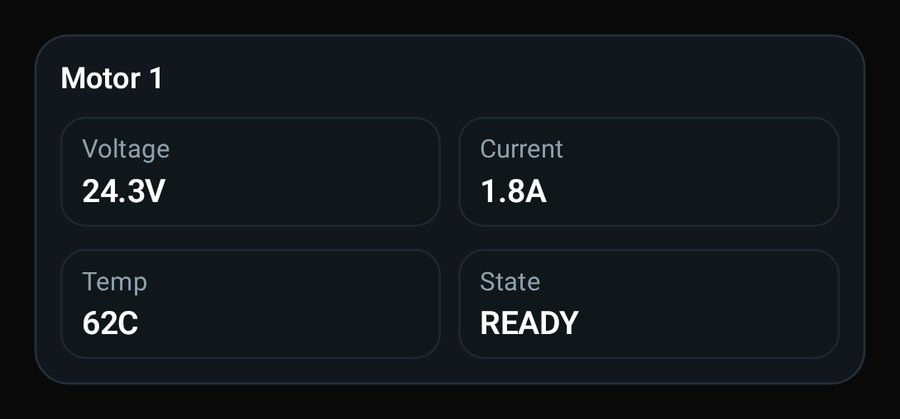
  <br />
  <sub>Compose: <code>KeyValueGridConsoleWidget(spec: ConsoleWidgetSpec.KeyValueGrid)</code></sub>
  <br />
  <sub>Команда: <code>ui type=kv-grid title="Motor 1" items="Voltage:24.3V|Current:1.8A|Temp:62C|State:READY" columns=2</code></sub>
</p>

Параметры:

- `title` - заголовок блока
- `items` - список пар в формате `KEY:VALUE` через `|`
- `columns` - число колонок в сетке, сейчас от `1` до `3`
- `bg` - фон карточки
- `border` - цвет рамки
- `titleColor` - цвет заголовка
- `keyColor` - цвет ключей
- `valueColor` - цвет значений

---

### `type=pin-bank`

Банк пинов и каналов с быстрым визуальным статусом.

Пример:

```text
ui type=pin-bank title="GPIO" items="D1:on|D2:off|D3:warn|A0:adc|PWM1:pwm"
```

<p align="center">
  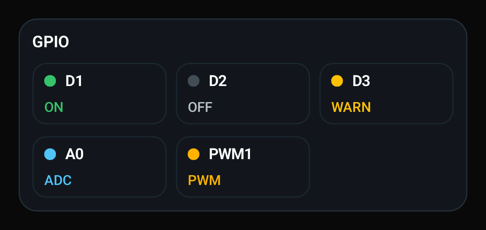
  <br />
  <sub>Compose: <code>PinBankConsoleWidget(spec: ConsoleWidgetSpec.PinBank)</code></sub>
  <br />
  <sub>Команда: <code>ui type=pin-bank title="GPIO" items="D1:on|D2:off|D3:warn|A0:adc|PWM1:pwm"</code></sub>
</p>

Параметры:

- `title` - заголовок блока
- `items` - список элементов в формате `PIN:STATE` через `|`
- `columns` - число колонок в сетке, сейчас от `1` до `4`
- `bg` - фон карточки
- `border` - цвет рамки
- `titleColor` - цвет заголовка
- `pinColor` - цвет имени пина
- `stateColor` - базовый цвет текста состояния

Поддерживаемые состояния в `items`:

- `on`, `1`, `high`, `enabled` - активный зеленый
- `off`, `0`, `low`, `disabled` - выключенный серый
- `warn`, `warning` - предупреждение
- `error`, `err`, `alarm`, `critical` - ошибка
- `adc`, `analog` - аналоговый вход
- `pwm` - PWM-канал
- `in`, `input` - цифровой вход
- `out`, `output` - цифровой выход
- вместо состояния можно передать и цвет, например `D1:#00E676`

---

### `type=timeline`

Лента событий и этапов процесса.

Пример:

```text
ui type=timeline title="Boot" items="12:01 Boot|12:03 WiFi connected|12:05 MQTT online"
```

<p align="center">
  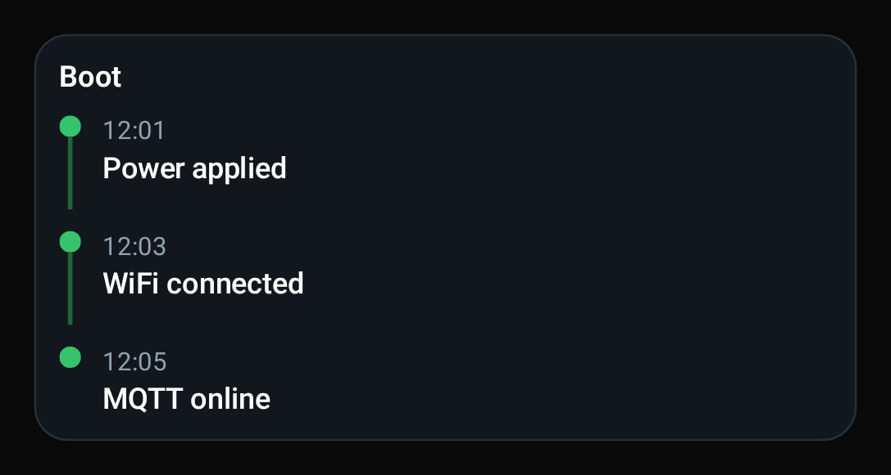
  <br />
  <sub>Compose: <code>TimelineConsoleWidget(spec: ConsoleWidgetSpec.Timeline)</code></sub>
  <br />
  <sub>Команда: <code>ui type=timeline title="Boot" items="12:01 Boot|12:03 WiFi connected|12:05 MQTT online"</code></sub>
</p>

Параметры:

- `title` - заголовок блока
- `items` - события через `|`
- формат события по умолчанию: `TIME TEXT`
- расширенный формат: `TIME~TEXT~SUBTITLE~COLOR`
- `line` или `color` - цвет линии и точек
- `bg` - фон карточки
- `border` - цвет рамки
- `titleColor` - цвет заголовка
- `timeColor` - цвет времени
- `textColor` - цвет основного текста
- `subtitleColor` - цвет дополнительной строки

---

### `type=line-chart`

Расширенный линейный график с подписями и шкалой. В отличие от `sparkline`, он больше и лучше подходит для отдельного аналитического блока.

Пример:

```text
ui type=line-chart title="Voltage" values="24.1,24.2,24.0,24.3,24.4" labels="T1|T2|T3|T4|T5" min=23 max=25 color=#4FC3F7
```

<p align="center">
  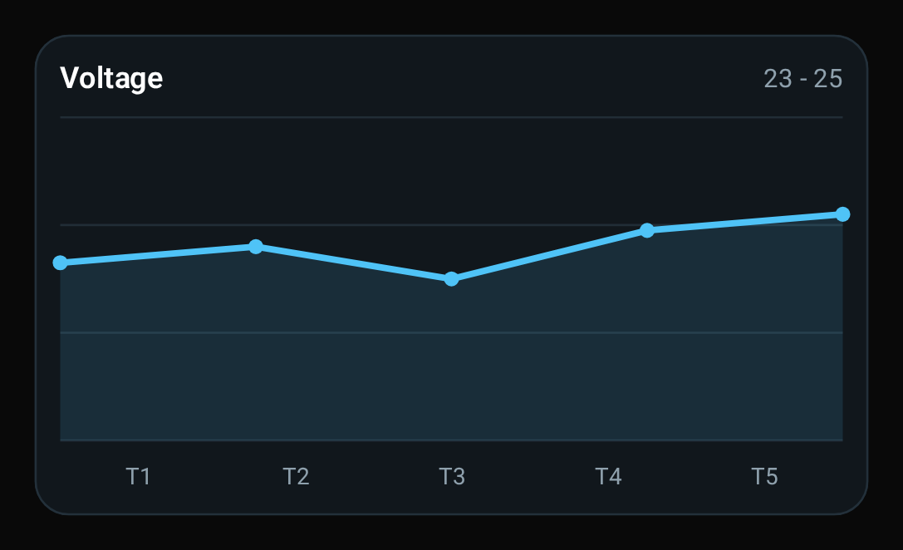
  <br />
  <sub>Compose: <code>LineChartConsoleWidget(spec: ConsoleWidgetSpec.LineChart)</code></sub>
  <br />
  <sub>Команда: <code>ui type=line-chart title="Voltage" values="24.1,24.2,24.0,24.3,24.4" labels="T1|T2|T3|T4|T5" min=23 max=25 color=#4FC3F7</code></sub>
</p>

Параметры:

- `values` - список чисел через `,`, `|` или `;`
- `labels` - подписи по оси X через `|`
- `title` - заголовок графика
- `min` - нижняя граница шкалы
- `max` - верхняя граница шкалы
- `color` - цвет линии
- `fill` - цвет подложки под линией
- `points` - показывать точки (`on/off`)
- `bg` - фон карточки
- `border` - цвет рамки
- `titleColor` - цвет заголовка
- `labelColor` - цвет подписей
- `axisColor` - цвет линий сетки

## Алиасы и заметки

- `widget` полностью эквивалентен `ui`
- `dot`, `circle` - одно и то же
- `image`, `icon` - одно и то же
- `panel`, `card` - одно и то же
- `progress`, `bar` - одно и то же
- `2col`, `twocol`, `pair` - одно и то же
- `table`, `grid` - одно и то же
- `switch`, `toggle` - одно и то же
- `alarm-card`, `alarm`, `alert` - одно и то же
- `sparkline`, `trend` - одно и то же
- `bar-group`, `bars`, `columns` - одно и то же
- `gauge`, `dial` - одно и то же
- `battery`, `cell` - одно и то же
- `led-row`, `leds`, `status-row` - одно и то же
- `stats-card`, `stat`, `metric-card` - одно и то же
- `kv-grid`, `kv`, `facts` - одно и то же
- `pin-bank`, `pins`, `gpio` - одно и то же
- `timeline`, `events`, `log` - одно и то же
- `line-chart`, `chart`, `plot` - одно и то же

## Где смотреть реализацию

- Протокол и `spec`: [ConsoleWidgetProtocol.kt](./ConsoleWidgetProtocol.kt)
- Базовый разбор команд: [ConsoleWidgetProtocolExtras.kt](./ConsoleWidgetProtocolExtras.kt)
- Разбор телеметрических команд: [ConsoleWidgetProtocolTelemetry.kt](./ConsoleWidgetProtocolTelemetry.kt)
- Разбор диагностических команд: [ConsoleWidgetProtocolDashboard.kt](./ConsoleWidgetProtocolDashboard.kt)
- Compose-виджеты: [`widgets/`](./widgets)


