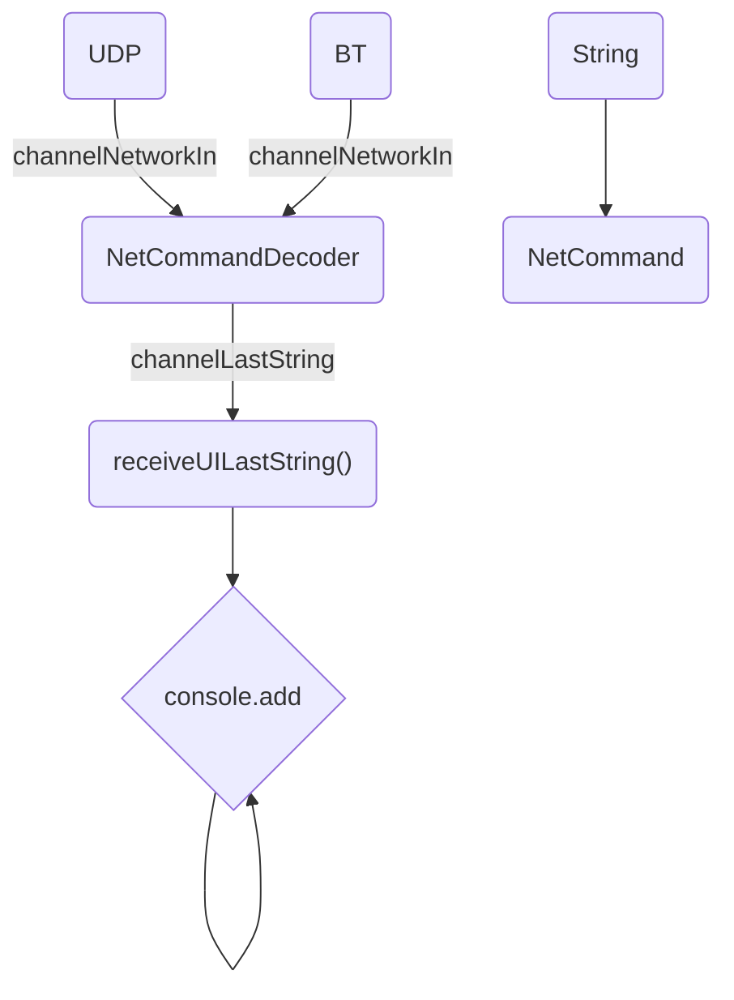
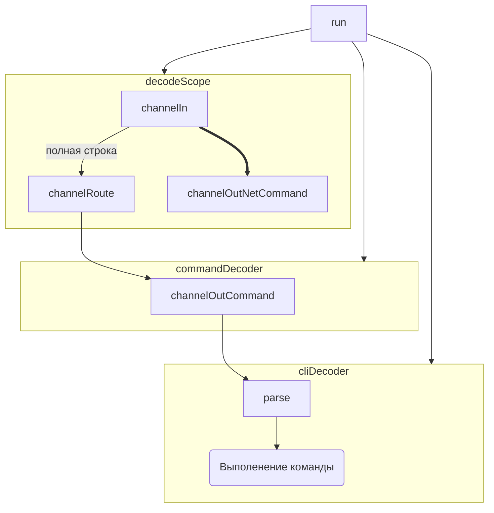

```mermaid
flowchart TD
    
A(UDP) --> |channelNetworkIn| B(NetCommandDecoder)
C(BT)  --> |channelNetworkIn| B(NetCommandDecoder)

node1(String) --> node2(NetCommand)

B --> |channelLastString| D("receiveUILastString()") -->  node4{console.add} --> node4

```

```kotlin
decoder.run()
decoder.addCmd("pong") {
}
```



```mermaid
flowchart TD
    run --> decodeScope
    run --> commandDecoder
    run --> cliDecoder


subgraph decodeScope
    channelIn -- полная строка --> channelRoute
    channelIn ==> channelOutNetCommand
end

subgraph commandDecoder
    channelRoute --> channelOutCommand
end

subgraph cliDecoder
    channelOutCommand --> parse --> r("Выполенение команды")
end

   

    
```

